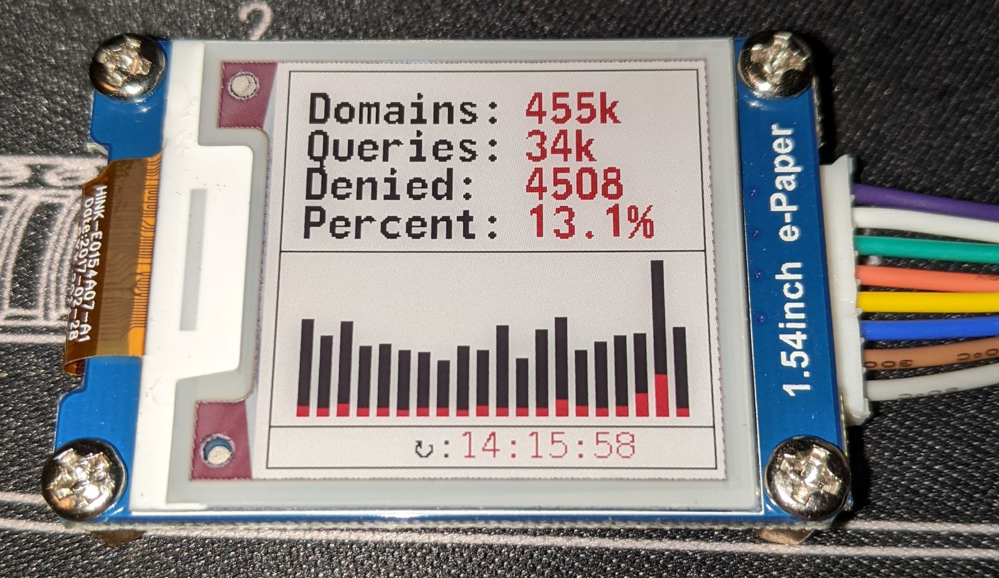

# Using the pihole-stats display
[e-Ink display I used](https://www.waveshare.com/product/displays/e-paper/epaper-3/1.54inch-e-paper-module-b.htm)  

## Install requirements
`sudo apt install git`  
`cd ~` the below scripts all assume this is installed to `/home/pi/pihole-stats/`  
`git clone https://github.com/scul86/pihole-stats.git`  
`cd pihole-stats`  
`chmod u+x install.sh`  
`./install.sh`  
This will create the log file and path, as well as installing and activating the systemd service and timer files to refresh the display.  

`pip3 install -r requirements.txt`  
Installs the python requirements

Download monofonto.ttf [from here](https://www.dafont.com/monofonto.font) and place in the `fonts` folder

Install DejaVuMono font:  
`sudo apt install fonts-dejavu`

## Enable SPI
`sudo raspi-config`  > `3 Interface Options` > `4P SPI`

You'll probably need to reboot now to ensure SPI access.

# Run the program
`./epaper_small.py`